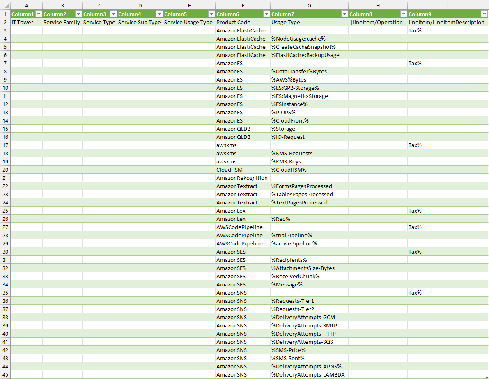

---
description: pew pew pew pew pew
---
# Отчёт Аналитическая лабораторная работа №1

## Состав команды
* Холод Виолетта https://t.me/maybevilou
* Сергеев Артём https://t.me/imrreyz
* Морозов Матвей 	https://t.me/jkkgmr
* Копытко Александр https://t.me/monegasquee

## Цель работы
Знакомство с облачными сервисами. Понимание уровней абстракции над инфраструктурой в облаке. Формирование понимания типов потребления сервисов в сервисной-модели. Сопоставление сервисов между разными провайдерами.

## Дано
1. Слепок данных биллинга от провайдера после небольшой обработки в виде SQL-параметров. Символ % в начале/конце означает, что перед/после него может стоять любой набор символов.
2. Google с документациями провайдера

## Исходные данные

## Описание сервисов

### Amazon ElastiCache:
Amazon ElastiCache - это управляемый кэш-сервис в облаке, предоставляемый Amazon Web Services (AWS). Этот сервис обеспечивает простой доступ к популярным системам кэширования, таким как Redis или Memcached, что позволяет улучшить производительность приложений путем ускорения доступа к данным.

### Amazon ES (Elasticsearch Service):
Amazon ES - это полностью управляемый сервис Elasticsearch, предоставляемый AWS. Elasticsearch - это распределенный поисковый и аналитический движок, который позволяет эффективно хранить и анализировать большие объемы данных.

### Amazon QLDB (Quantum Ledger Database):
Amazon QLDB - это управляемая база данных журнала, предназначенная для создания надежных, прозрачных и неизменяемых журналов транзакций. Этот сервис поддерживает использование блокчейн-подобной технологии для обеспечения надежности и целостности данных.

### AWS KMS (Key Management Service):
AWS KMS - это сервис управления ключами, предоставляющий инструменты для создания и управления ключами шифрования. Он позволяет обеспечить безопасное хранение и использование ключей шифрования для защиты данных в различных сервисах AWS.

### CloudHSM (Hardware Security Module):
CloudHSM - это сервис, предоставляющий аппаратные модули безопасности для хранения ключей шифрования и выполнения криптографических операций. Он помогает обеспечивать высокий уровень безопасности для приложений и данных в облаке.

### Amazon Rekognition:
Amazon Rekognition - это сервис компьютерного зрения, который позволяет анализировать изображения и видео для распознавания объектов, лиц, текста и других элементов. Этот сервис может использоваться для создания разнообразных приложений в области распознавания и анализа контента.

### Amazon Textract:
Amazon Textract - это сервис распознавания текста, который автоматически извлекает текст и структурированные данные из документов, таких как формы, таблицы и отсканированные изображения.

### Amazon Lex:
Amazon Lex - это служба глубокого обучения, которая позволяет создавать разговорные интерфейсы и чат-боты. Этот сервис используется для разработки приложений, в которых пользователи могут взаимодействовать с системой с использованием естественного языка.

### AWS Code Pipeline:
AWS CodePipeline - полностью управляемый сервис для автоматизации процессов непрерывной поставки (CI/CD) (Continuous Integration/Continuous Deployment). Обеспечивает создание, тестирование и развертывание кода с использованием гибких конвейеров, интеграцию с различными инструментами разработки.

### Amazon SES (Simple Email Service):
Amazon SES - это служба отправки электронной почты в облаке, предоставляемая AWS. Она позволяет отправлять электронные письма с высокой степенью масштабируемости, надежности и безопасности.

### Amazon SNS (Simple Notification Service):
Amazon Simple Notification Service (SNS) - масштабируемый и гибкий сервис для отправки уведомлений и сообщений. Обеспечивает интеграцию с различными конечными точками, включая электронную почту, пуш-уведомления и SMS. Поддерживает как взаимодействие между приложениями (A2A), так и уведомления конечным пользователям (A2P).

## Маппинг
После изучения AWS и Yandex Cloud был произведён маппинг сервисов.
|  Amazon                     | Yandex Cloud**                           | Примечание                                                                         |
|-----------------------------|------------------------------------------|------------------------------------------------------------------------------------|
| Amazon ElastiCache          | Yandex Managed Service for Redis         |                                                                                    |
| Amazon ES                   | Yandex Managed Service for Elasticsearch |                                                                                    |
| AmazonQLDB                  | Нет точного аналога                      |  В Yandex Cloud можно использовать базы данных, такие как Yandex Database.         |
| AWS KMS                     | Yandex Key Management Service            |                                                                                    |
| CloudHSM                    | Нет точного аналога                      |  Yandex Key Management Service (KMS) в комбинации с использованием аппаратных HSM. |
| Amazon Rekognition          | Yandex Vision API                        |                                                                                    |
| Amazon Textract             | Нет точного аналога                      |  AWS Textract предоставляет более широкий набор функций для обработки документов   |
| Amazon Lex                  | Yandex SpeechKit                         |                                                                                    |
| AWS Code Pipeline           | Yandex Cloud CI/CD                       |                                                                                    |
| Amazon SES                  | Yandex Mail for Domain                   |                                                                                    |
| Amazon SNS                  | Yandex Message Queue (MQ)                |                                                                                    |

** аналоги могут иметь некоторые различия в функциональности и подходах к реализации

## Возможность миграции
Исходя из проведенного маппинга сервисов между AWS и Yandex Cloud, можно сделать следующие заключения:
### Близкие аналогии:
Некоторые сервисы имеют довольно близкие аналогии между AWS и Yandex Cloud, такие как Amazon S3 и Yandex Object Storage, Amazon SNS и Yandex Message Queue, а также AWS CodePipeline и Yandex Cloud CI/CD. Это облегчит процесс миграции, поскольку аналогичные функции предоставляются обоими облачными провайдерами.
### Вынужденное комбинирование сервисов:
В ряде случаев может потребоваться комбинирование нескольких сервисов Yandex Cloud для полного соответствия функциональности сервисам AWS. Это может включать в себя использование нескольких инструментов для достижения аналогичных целей.
### Адаптация
В процессе миграции может потребоваться адаптация конфигураций и кодов базы данных, особенно если используются специфические функции или API, которые могут отличаться между облачными провайдерами.
## Вывод
Миграция между облачными провайдерами, такими как AWS и Yandex Cloud, может быть сложным процессом из-за различий в архитектуре, сервисах и API. В целом, успешная миграция зависит от тщательного планирования, тестирования и адаптации с учетом специфики каждого сервиса. Важно также взаимодействие с командой разработчиков и администраторов для обеспечения плавного перехода и минимизации возможных проблем.

## Итоговая таблица
| IT Tower | Service Family | Service Type | Service Usage Type | Product Code | Usage Type | lineItem/LineItemDescription | Пояснение | Yandex.Cloud |
|----------|----------------|--------------|---------------------|--------------|------------|----------------------------|------------|--------------|
| Storage  | Database       | ElastiCache   | Tax                 | AmazonElastiCache |            |                            |            | Tax%         | Yandex Managed Service for Redis |
| Storage  | Database       | ElastiCache   | Usage per GB        | AmazonElastiCache | %NodeUsage:cache% |               |              | Yandex Managed Service for Redis |
| Storage  | Database       | ElastiCache   | Create Backup       | AmazonElastiCache | %CreateCacheSnapshot% |          |              | Yandex Managed Service for Redis |
| Storage  | Database       | ElastiCache   | Storage Backup      | AmazonElastiCache | %ElastiCache:BackupUsage |       |              | Yandex Managed Service for Redis |
| Storage  | Analytics       | OpenSearch Service | Tax              | AmazonES     |          |                            |            | Tax%         | Yandex Managed Service for Elasticsearch |
| Storage  | Analytics       | OpenSearch Service | Data transfer charges | AmazonES | %DataTransfer%Bytes |           |              | Yandex Managed Service for Elasticsearch |
| Storage  | Analytics       | OpenSearch Service | Bytes            | AmazonES     | %AWS%Bytes                 |       |              | Yandex Managed Service for Elasticsearch |
| Storage  | Analytics       | OpenSearch Service | General Purpose SSD | AmazonES  | %ES:GP2-Storage%           |       |              | Yandex Managed Service for Elasticsearch |
| Storage  | Analytics       | OpenSearch Service | Magnetic Storage | AmazonES   | %ES:Magnetic-Storage       |       |              | Yandex Managed Service for Elasticsearch |
| Storage  | Analytics       | OpenSearch Service | Instance Usage   | AmazonES   | %ESInstance%               |       |              | Yandex Managed Service for Elasticsearch |
| Storage  | Analytics       | OpenSearch Service | Provisioned IOPS | AmazonES  | %PIOPS%                    |       |              | Yandex Managed Service for Elasticsearch |
| Storage  | Analytics       | OpenSearch Service | Cloudfront Usage | AmazonES | %CloudFront%               |       |              | Yandex Managed Service for Elasticsearch |
| Storage  | Database        | AmazonQLDB     | Storage Rate      | AmazonQLDB | %Storage                   |       | ***Yandex Database*** - Нет точного аналога |
| Storage  | Database        | AmazonQLDB     | IO requests per second | AmazonQLDB | %IO-Request        |       |              | ***Yandex Database*** - Нет точного аналога |
| Security & Compliance | Security, Identity, & Compliance | Key Management Service | Tax | awskms |       |                           |            | Tax%         | Yandex Key Management Service (KMS) |
| Security & Compliance | Security, Identity, & Compliance | Key Management Service | Requests per month | awskms | %KMS-Requests |                  |              | Yandex Key Management Service (KMS) |
| Security & Compliance | Security, Identity, & Compliance | Key Management Service | Keys count | awskms | %KMS-Keys           |               |              | Yandex Key Management Service (KMS) |
| Security & Compliance | Security, Identity, & Compliance | CloudHSM | Hourly price per HSM | CloudHSM | %CloudHSM%        |                  | ***Yandex Key Management Service (KMS)*** в комбинации с использованием аппаратных HSM. |
| Output   | Machine Learning | Rekognition   | Analysis           | AmazonRekognition |                   |                           |            |              | Yandex Vision API |
| Output   | Machine Learning | Textract       | Forms count        | AmazonTextract | %FormsPagesProcessed |             | *** *** - Нет точного аналога |
| Output   | Machine Learning | Textract       | Tables count       | AmazonTextract | %TablesPagesProcessed |            | *** *** - Нет точного аналога |
| Output   | Machine Learning | Textract       | Text count         | AmazonTextract | %TextPagesProcessed |              | *** *** - Нет точного аналога |
| End User | Machine Learning | Lex            | Tax                | AmazonLex     |                   |                           |            | Tax%         | Yandex SpeechKit |
| End User | Machine Learning | Lex            | Requests count     | AmazonLex     | %Req%                     |          |              | Yandex SpeechKit |
| Delivery | Developer Tools  | CodePipeline   | Tax                | AWSCodePipeline |                 |                           |            | Tax%         | Yandex Cloud CI/CD |
| Delivery | Developer Tools  | CodePipeline   | Trial pipelines    | AWSCodePipeline | %trialPipeline% |               |              | Yandex Cloud CI/CD |
| Delivery | Developer Tools  | CodePipeline   | V1 active pipelines | AWSCodePipeline | %activePipeline% |             |              | Yandex Cloud CI/CD |
| End User | Business Applications | Simple Email Service | Tax | AmazonSES |                        |                  | Tax%         | Yandex Mail for Domain |
| End User | Business Applications | Simple Email Service | Recipients count | AmazonSES | %Recipients% |            |              | Yandex Mail for Domain |
| End User | Business Applications | Simple Email Service | Attachments Size | AmazonSES | %AttachmentsSize-Bytes |     |              | Yandex Mail for Domain |
| End User | Business Applications | Simple Email Service | Incoming mail chunks | AmazonSES | %ReceivedChunk% |         |              | Yandex Mail for Domain |
| End User | Business Applications | Simple Email Service | Message charges | AmazonSES | %Message%    |                |              | Yandex Mail for Domain |
| End User | Application Integration | Simple Notification Service | Tax | AmazonSNS |               |                  | Tax%         | Yandex Message Queue (MQ) |
| End User | Application Integration | Simple Notification Service | Type FIFO | AmazonSNS | %Requests-Tier1 |         |              | Yandex Message Queue (MQ) |
| End User | Application Integration | Simple Notification Service | Type Standart | AmazonSNS | %Requests-Tier2 |      |              | Yandex Message Queue (MQ) |
| End User | Application Integration | Simple Notification Service | Delivery via GCM | AmazonSNS | %DeliveryAttempts-GCM |  |              | Yandex Message Queue (MQ) |
| End User | Application Integration | Simple Notification Service | Delivery via SMTP | AmazonSNS | %DeliveryAttempts-SMTP |  |           | Yandex Message Queue (MQ) |
| End User | Application Integration | Simple Notification Service | Delivery via HTTP | AmazonSNS | %DeliveryAttempts-HTTP |  |          | Yandex Message Queue (MQ) |
| End User | Application Integration | Simple Notification Service | Delivery via SQS | AmazonSNS | %DeliveryAttempts-SQS |   |          | Yandex Message Queue (MQ) |
| End User | Application Integration | Simple Notification Service | Price per SMS | AmazonSNS | %SMS-Price% |            |              | Yandex Message Queue (MQ) |
| End User | Application Integration | Simple Notification Service | Sent messages count | AmazonSNS | %SMS-Sent% |    |              | Yandex Message Queue (MQ) |
| End User | Application Integration | Simple Notification Service | Delivery via APN | AmazonSNS | %DeliveryAttempts-APNS% | |        | Yandex Message Queue (MQ) |
| End User | Application Integration | Simple Notification Service | Delivery via Lambda | AmazonSNS | %DeliveryAttempts-LAMBDA% | |     | Yandex Message Queue (MQ) |
